<div align="center">



</div>

<br>

```text
$ whoami

Vidushi Saxena

Creative Frontend Developer

Crafting digital experiences that move,
respond, and feel alive.
```

<br>

```text
$ cat system.log

STATUS      ONLINE

LOCATION    India

EXPERIENCE  1.5+ Years

FOCUS       Creative Development
            Motion Design
            WebGL Experiences

CURRENT     Building immersive interfaces with
            React, Next.js, Three.js and GSAP.
```

---

## `$ ls modules`

```text
✓ React
✓ Next.js
✓ TypeScript
✓ JavaScript

✓ Three.js
✓ React Three Fiber
✓ WebGL

✓ GSAP
✓ Framer Motion
✓ Tailwind CSS

✓ Git
✓ Figma
✓ Vercel
```

---

## `$ tree projects`

```text
.
├── portfolio/
│   Personal creative portfolio and experiments
│
├── 3d-experiments/
│   Three.js · R3F · WebGL · Shaders
│
├── hyperiux-vault/
│   Contributor
│   Source-first React interaction components
│
└── creative-components/
    Reusable UI animations and interactions
```

---

## `$ git status`

<div align="center">

<!-- 

 -->

</div>

<br>

<div align="center">


</div>

<br>

<div align="center">
<!-- 
 -->

</div>

---

## `$ cat mission.txt`

```text
Design interfaces people remember.

Engineer interactions that feel natural.

Keep learning.

Keep building.

Never stop experimenting.
```

---

## `$ connect`

<div align="center">

<a href="https://github.com/vidushisaxen">GitHub</a> •
<a href="https://www.linkedin.com/in/vidushi-saxena-071786228/">LinkedIn</a> •

</div>