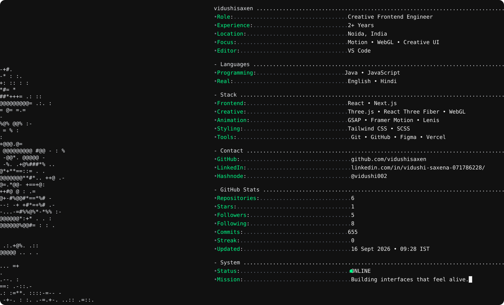

---

`terminal.svg` is generated automatically from [`template.svg`](./template.svg) by [`scripts/update-svg.js`](./scripts/update-svg.js), running on a schedule via [`.github/workflows/terminal.yml`](./.github/workflows/terminal.yml).

The workflow requires a `GITHUB_TOKEN` (the default Actions token works for public read access; a Personal Access Token with `read:user` scope may be needed for full contribution/commit data) available as the `GITHUB_TOKEN` secret.
